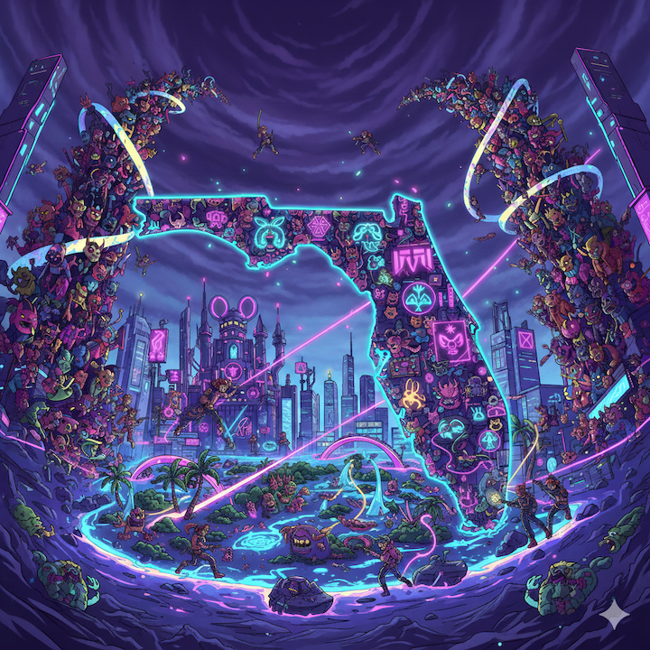
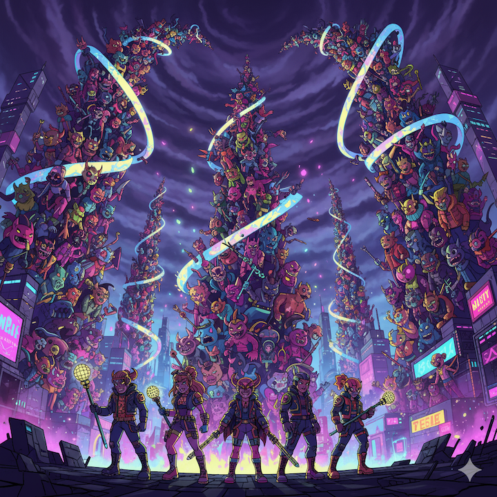
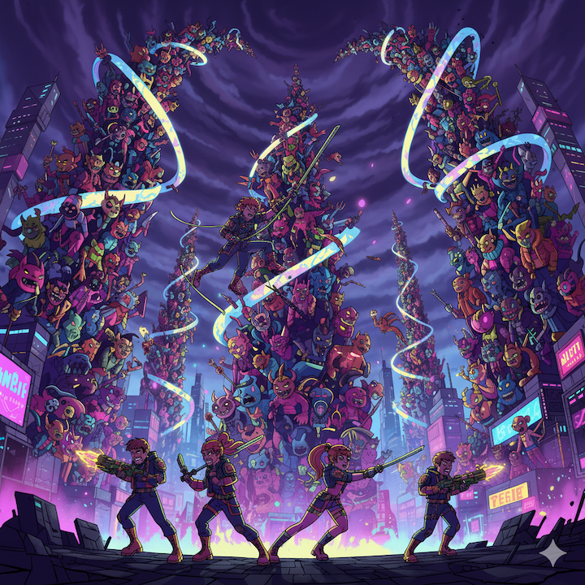
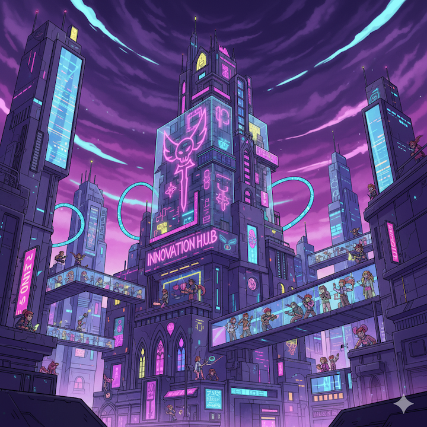
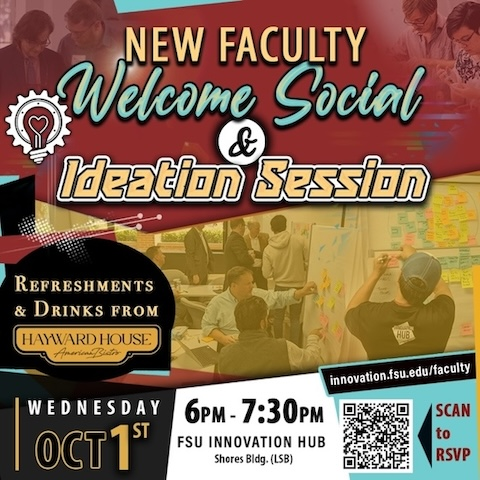

```{r setup, include=FALSE}
usethis::use_git_ignore(c("*.csv", "*.rds"))
options(htmltools.dir.version = FALSE)

library(knitr)
library(tidyverse)
library(xaringan)
library(fontawesome)
```


class: inverse, center, middle

# `r fa("fas fa-images", fill = "#fff")` **Slides** 

[bretsw.com/new-faculty-hub2025](https://bretsw.com/new-faculty-hub2025/)


---

class: regular, center, top

# `r fa("fas fa-location-dot", fill = "#fff")` Welcome!

```{r, out.width = "480px", echo = FALSE, fig.align = "center"}

```


---

class: regular, center, top

# `r fa("fas fa-radiation", fill = "#fff")` Wicked Challenges

```{r, out.width = "480px", echo = FALSE, fig.align = "center"}

```

--

### In your first 6 weeks at FSU, what challenges have you encountered?


---

class: regular, center, top

# `r fa("fas fa-otter", fill = "#fff")` How Might We...

```{r, out.width = "480px", echo = FALSE, fig.align = "center"}

```


---

class: inverse, center, top

# How might we...

--

### navigate our impossible expectations of ourselves at an institution climbing relentlessly during a time fraught with discord <br><br>

--

### while developing our identities as faculty members and scholars, <br><br>

--

### so that our labor can serve students and impact our community, the state of Florida, and the world?


---

class: regular, center, top

# `r fa("fas fa-glasses", fill = "#fff")` Spa Goggles

```{r, out.width = "480px", echo = FALSE, fig.align = "center"}

```

### Great local beer from [Ology](https://ologybrewing.com/)

---

class: regular, center, top

# `r fa("fas fa-glasses", fill = "#fff")` Spa Goggles

```{r, out.width = "480px", echo = FALSE, fig.align = "center"}

```

### Acronym for <u>S</u>tart + <u>P</u>ractice + <u>A</u>ssess


---

class: regular, center, top

# `r fa("fas fa-glasses", fill = "#fff")` Spa Goggles

```{r, out.width = "480px", echo = FALSE, fig.align = "center"}

```

### <u>S</u>tart: Goals + Context


---

class: regular, center, top

# `r fa("fas fa-glasses", fill = "#fff")` Spa Goggles

```{r, out.width = "480px", echo = FALSE, fig.align = "center"}

```

### <u>P</u>ractice: Explore + Seek Support


---

class: regular, center, top

# `r fa("fas fa-glasses", fill = "#fff")` Spa Goggles

```{r, out.width = "480px", echo = FALSE, fig.align = "center"}

```

### <u>A</u>ssess: Regulate + Evaluate


---

class: regular, center, top

# `r fa("fas fa-arrows-to-circle", fill = "#fff")` Innovation Hub

```{r, out.width = "480px", echo = FALSE, fig.align = "center"}

```

### The premier problem-solving community on campus, <br>if not the world


---

class: regular, center, top

# `r fa("fas fa-arrows-to-circle", fill = "#fff")` Innovation Hub

```{r, out.width = "480px", echo = FALSE, fig.align = "center"}

```

### What might the Innovation Hub do for you?


---

class: regular, center, top

# `r fa("fas fa-arrows-to-circle", fill = "#fff")` Innovation Hub

```{r, out.width = "480px", echo = FALSE, fig.align = "center"}

```

### https://innovation.fsu.edu/faculty
